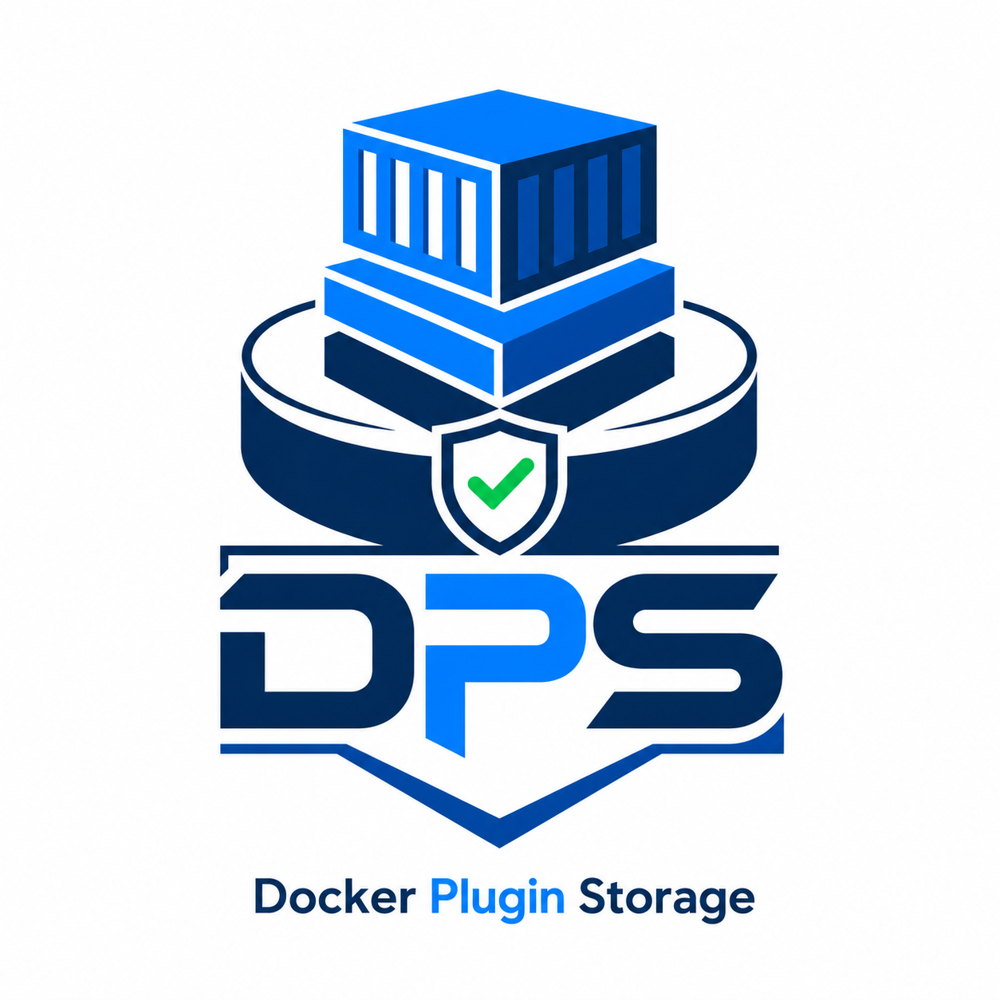
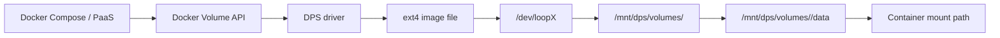

<p align="center">
  
</p>

<p align="center">
  <strong>Local Docker volumes with predictable storage and inode limits.</strong>
</p>

<p align="center">
  <a href="#quick-start">Quick Start</a> ·
  <a href="#compose-usage">Compose Usage</a> ·
  <a href="#operations">Operations</a> ·
  <a href="docs/production-dokploy.md">Dokploy/Coolify</a> ·
  <a href="docs/local-testing.md">Local Testing</a>
</p>

<p align="center">
  
  
  
  
</p>

---

## Overview

DPS, or Docker Plugin Storage, is a Docker volume driver for local persistent
volumes with per-volume storage and inode limits.

It is designed for ordinary Linux Docker hosts and Compose-based PaaS
environments such as Dokploy and Coolify, where teams need a simple way to keep
application volumes inside predictable disk boundaries.

Docker named volumes are convenient, but Docker does not provide a clean,
portable, Compose-friendly storage quota model for them. DPS fills that gap with
a conservative host-local design: one ext4 filesystem image per volume, mounted
through a Linux loop device, then exposed to Docker as a clean data directory.

## What DPS Provides

| Capability | Purpose |
| --- | --- |
| Per-volume size limits | Validate from inside containers with `df -h`. |
| Per-volume inode limits | Validate from inside containers with `df -i`. |
| Compose-first syntax | Use `driver: dps` and `driver_opts` in `docker-compose.yml`. |
| Host defaults | Set default size/inodes once for all volumes on a host. |
| Offline resize up/down | Grow, shrink, or change inode count with data-fit checks. |
| Snapshots | Local tar archives with manifest, byte count, and SHA-256 verification. |
| Backups | Local and S3-compatible backup targets with checksum verification. |
| Database-aware policies | Offline default, explicit crash-consistent mode, and hooks. |
| Safe uninstall | Removes DPS integration without removing apps or data by default. |

## Storage Model



Path layout:

```text
/var/lib/dps/volume-images/<volume>.img   # real volume data image
/mnt/dps/volumes/<volume>                 # internal ext4 mount
/mnt/dps/volumes/<volume>/data            # path returned to Docker
```

The `data` subdirectory is intentional. ext filesystems create internal
metadata such as `lost+found` at the filesystem root. DPS keeps that metadata
away from the application mount path, so databases and apps that require an
empty first-boot directory can initialize normally.

Containers usually show DPS volumes as `/dev/loopX`. That is expected: Linux is
presenting the DPS image file as a block device.

## Quick Start

Install on an Ubuntu 24.04 arm64 host with Docker already installed:

```sh
curl -fsSL https://raw.githubusercontent.com/tiagobecker/docker-plugin-storage/main/scripts/install-ubuntu-24.04-arm64-dokploy.sh -o install-dps.sh
sudo bash install-dps.sh
```

The installer:

- validates the host and Docker connection;
- installs the host packages DPS needs;
- builds and installs `dpsd` and `dpsctl`;
- registers the `dpsd` systemd service;
- writes `/etc/dps/dpsd.env`;
- starts DPS and creates a real test volume;
- prints a visible success or failure summary.

Default host configuration:

```text
DPS_ROOT=/var/lib/dps
DPS_IMAGE_ROOT=/var/lib/dps/volume-images
DPS_MOUNT_ROOT=/mnt/dps
DPS_DEFAULT_VOLUME_SIZE=5G
DPS_DEFAULT_VOLUME_INODES=200000
DPS_ARCHIVE_POLICY=offline
```

Place volume image files on another disk or directory:

```sh
sudo env DPS_IMAGE_ROOT=/srv/dps-images bash install-dps.sh
```

Change the host-wide default size:

```sh
sudo env DPS_DEFAULT_VOLUME_SIZE=2G bash install-dps.sh
```

## Compose Usage

```yaml
services:
  postgres:
    image: postgres:16
    environment:
      POSTGRES_PASSWORD: example
    volumes:
      - pgdata:/var/lib/postgresql/data

volumes:
  pgdata:
    driver: dps
    driver_opts:
      size: 5G
      inodes: "500000"
```

If host defaults are acceptable, `driver_opts` can be omitted:

```yaml
volumes:
  appdata:
    driver: dps
```

Validate limits from inside the container:

```sh
docker exec -it <container> df -h /path/to/volume
docker exec -it <container> df -i /path/to/volume
```

Expected shape:

```text
Filesystem      Size  Used Avail Use% Mounted on
/dev/loopX      5.0G  ...  ...   ...  /path/to/volume

Filesystem     Inodes IUsed IFree IUse% Mounted on
/dev/loopX      500000 ...   ...   ... /path/to/volume
```

Small inode differences are normal because `mkfs.ext4` may round the requested
inode count to a valid filesystem layout.

## Dokploy And Coolify

DPS works at the Docker host level. Install it on every Docker host where
Compose projects should be able to use `driver: dps`.

For Dokploy or Coolify templates, keep the volume declaration explicit:

```yaml
volumes:
  app-data:
    driver: dps
    driver_opts:
      size: 2G
      inodes: "50000"
```

If a project was previously deployed with Docker's default `local` driver,
Docker will not convert that existing volume to DPS. Stop/remove the app through
the PaaS UI, back up data if needed, remove or rename the old volume, then
redeploy with `driver: dps`.

See [Dokploy And Coolify Setup](docs/production-dokploy.md) for the full
production-style workflow.

## Host Service

Build locally:

```sh
make build
```

Run as an unmanaged Docker volume plugin:

```sh
sudo ./bin/dpsd \
  --root /var/lib/dps \
  --mount-root /mnt/dps \
  --image-root /var/lib/dps/volume-images \
  --default-volume-size 5G \
  --default-volume-inodes 200000 \
  --socket /run/docker/plugins/dps.sock
```

Important paths:

| Flag | Purpose |
| --- | --- |
| `--root` | Metadata, snapshots, and temporary files. |
| `--image-root` | ext4 image files that hold real volume data. |
| `--mount-root` | Internal mount root; Docker receives `<mount-root>/volumes/<volume>/data`. |

## Configuration

| Variable | Default | Purpose |
| --- | --- | --- |
| `DPS_ROOT` | `/var/lib/dps` | Metadata, snapshots, temporary files. |
| `DPS_IMAGE_ROOT` | `<DPS_ROOT>/volume-images` | Volume image files. Put this on the storage path where data should live. |
| `DPS_MOUNT_ROOT` | `/mnt/dps` | Internal mount root. Docker receives each volume's `data` subdirectory. |
| `DPS_DEFAULT_VOLUME_SIZE` | `5G` | Default size when Compose omits `driver_opts.size`. |
| `DPS_DEFAULT_VOLUME_INODES` | `200000` | Default inode count when Compose omits `driver_opts.inodes`. |
| `DPS_ARCHIVE_POLICY` | `offline` | Snapshot/backup consistency policy. |
| `DPS_PRE_ARCHIVE_HOOK` | empty | Hook command for `hooked` policy. |
| `DPS_POST_ARCHIVE_HOOK` | empty | Hook command for `hooked` policy. |
| `DPS_ARCHIVE_HOOK_TIMEOUT` | `10m` | Hook timeout. |
| `DPS_SOCKET` | `/run/docker/plugins/dps.sock` | Docker plugin socket. |

## Resize

Resize is offline. Stop the workload first or ensure Docker has released the
volume.

```sh
dpsctl resize pgdata 10G 800000
```

Behavior:

- increasing size grows the ext4 image when possible;
- decreasing size recreates the image and restores data;
- changing inode count recreates the filesystem because ext4 inode count is
  fixed at creation;
- shrink operations are refused unless current usage fits with at least 10%
  headroom;
- mounted volumes are refused for resize.

## Snapshots

Create a local snapshot:

```sh
dpsctl snapshot pgdata before-upgrade
```

Restore:

```sh
dpsctl restore before-upgrade pgdata
```

Snapshots are `tar.gz` archives of the volume data directory. DPS writes a
manifest, records byte count and SHA-256, verifies before restore, and refuses
restore into mounted volumes.

## Backups

Back up a snapshot locally:

```sh
dpsctl backup before-upgrade /srv/dps-backups
```

Stream a volume backup without first writing a snapshot file:

```sh
dpsctl backup-volume pgdata /srv/dps-backups pgdata-manual
```

S3-compatible target:

```sh
export AWS_ACCESS_KEY_ID=...
export AWS_SECRET_ACCESS_KEY=...
export AWS_REGION=us-east-1

dpsctl backup-volume pgdata s3://bucket/prod pgdata-manual
dpsctl backup-verify s3://bucket/prod pgdata-manual
```

For MinIO or another compatible endpoint:

```sh
export AWS_ENDPOINT_URL=https://minio.example.com
export AWS_S3_FORCE_PATH_STYLE=true
```

Backups include manifests and checksums. Verification reads the backup payload
and compares it with the recorded manifest.

## Data Consistency

The default policy is `offline`: DPS refuses `snapshot` and `backup-volume`
while the volume has active Docker references. This is the safest default for
databases and stateful services.

Recommended flows:

- Stop the app in Dokploy/Coolify, run snapshot or backup, then start it again.
- Use `DPS_ARCHIVE_POLICY=hooked` with tested pre/post hooks that quiesce the
  database.
- Keep logical database backups in addition to DPS volume backups for critical
  production databases.

Mounted capture is explicit:

```sh
dpsctl --archive-policy crash-consistent backup-volume pgdata /srv/dps-backups pgdata-crash
```

Hooked capture:

```sh
dpsctl --archive-policy hooked \
  --pre-archive-hook '/etc/dps/hooks/postgres-pre.sh' \
  --post-archive-hook '/etc/dps/hooks/postgres-post.sh' \
  backup-volume pgdata s3://bucket/prod pgdata-hooked
```

## Managed Docker Plugin

DPS can also be packaged as a Docker managed plugin:

```sh
make plugin-rootfs
docker plugin create dps:latest packaging/docker-plugin
docker plugin set dps:latest DPS_DEFAULT_VOLUME_SIZE=5G
docker plugin set dps:latest DPS_DEFAULT_VOLUME_INODES=200000
docker plugin set dps:latest DPS_ARCHIVE_POLICY=offline
docker plugin enable dps:latest
```

Compose with managed plugin name:

```yaml
volumes:
  pgdata:
    driver: dps:latest
    driver_opts:
      size: 5G
      inodes: "500000"
```

For production PaaS hosts, the unmanaged systemd service is the recommended
path because it uses the host namespace directly and is easier to debug. The
managed plugin package requests `CAP_SYS_ADMIN` and loop device access.

## Operations

Monitor host storage and mounts:

```sh
df -h /var/lib/dps/volume-images
du -sh /var/lib/dps/volume-images
findmnt -R /mnt/dps
losetup -a | grep /var/lib/dps || true
```

Operational notes:

- Sparse images can overcommit the host if total configured volume sizes exceed
  real disk capacity.
- One mounted DPS volume consumes one loop device and one mount.
- Monitor active loop devices and mount count when running many volumes.
- Keep `DPS_IMAGE_ROOT` on fast local SSD/NVMe storage for database-heavy
  workloads.
- S3-compatible storage is for backup/sync, not as a live POSIX filesystem.
- DPS is local-scope storage; install it separately on each Docker host.

## Diagnostics

If a PaaS UI reports only a generic Compose error, collect host diagnostics:

```sh
curl -fsSL https://raw.githubusercontent.com/tiagobecker/docker-plugin-storage/main/scripts/diagnose-dokploy-dps.sh -o diagnose-dokploy-dps.sh
sudo bash diagnose-dokploy-dps.sh
```

Include a small DPS create/mount/remove test:

```sh
sudo env DPS_DIAG_RUN_VOLUME_TEST=true bash diagnose-dokploy-dps.sh
```

## Uninstall

The uninstall script removes DPS software and integration points while
preserving Dokploy/Coolify apps, containers, Docker volumes, and DPS image data
by default.

```sh
curl -fsSL https://raw.githubusercontent.com/tiagobecker/docker-plugin-storage/main/scripts/uninstall-dps-host.sh -o uninstall-dps-host.sh
sudo bash uninstall-dps-host.sh
```

Non-interactive:

```sh
sudo env DPS_UNINSTALL_CONFIRM=erase-dps bash uninstall-dps-host.sh
```

Optional data removal requires explicit opt-in:

```sh
sudo env DPS_UNINSTALL_CONFIRM=erase-dps DPS_UNINSTALL_REMOVE_DATA=true bash uninstall-dps-host.sh
```

Optional Docker volume metadata removal also requires explicit opt-in:

```sh
sudo env DPS_UNINSTALL_CONFIRM=erase-dps DPS_UNINSTALL_REMOVE_DOCKER_VOLUMES=true bash uninstall-dps-host.sh
```
